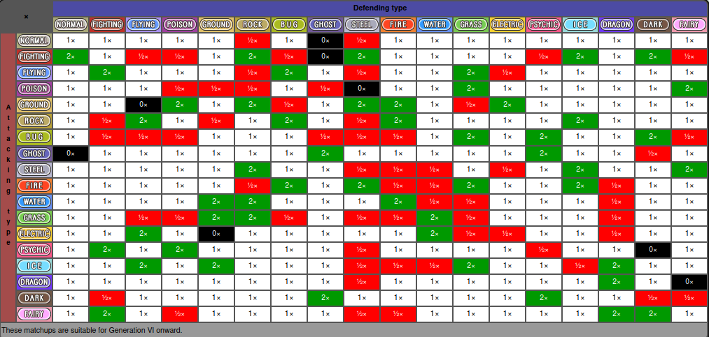

# PokéCLI

Command-line Pokémon Battle for Windows(?) and \*nix.

## Build

    mkdir build && make

## Resources

### Type Effectiveness Chart

Credit: Bulbapedia

### Damage Calculation

Credit: Bulbapedia

# Credits

Resources from Bulbapedia are used under terms of Attribution-NonCommercial-ShareAlike 2.5 Generic (CC BY-NC-SA 2.5)
<https://creativecommons.org/licenses/by-nc-sa/2.5/>

Pokémon © 2002-2022 Pokémon. © 1995-2022 Nintendo/Creatures Inc./GAME FREAK inc. TM, ® and Pokémon character names are trademarks of Nintendo.

